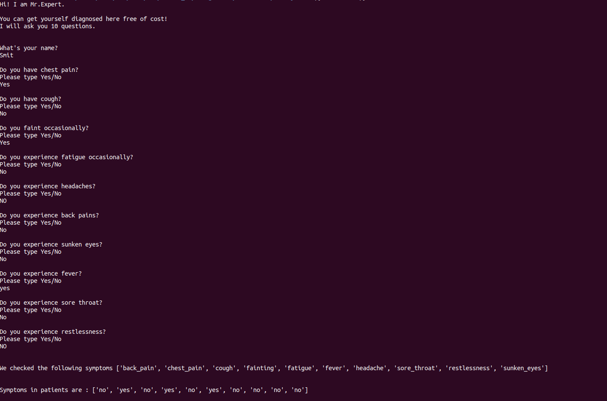
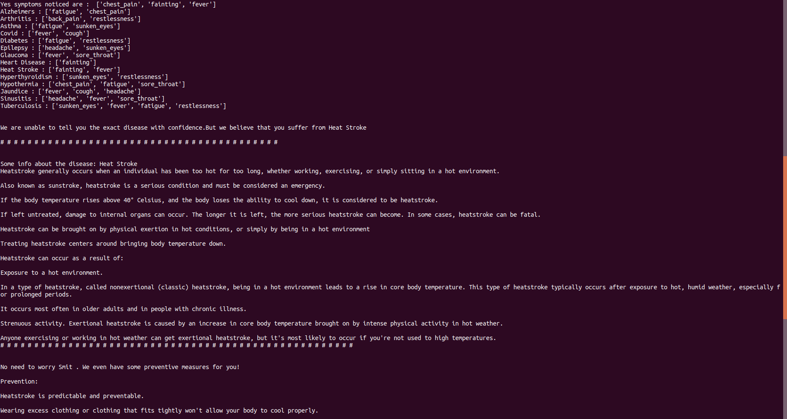
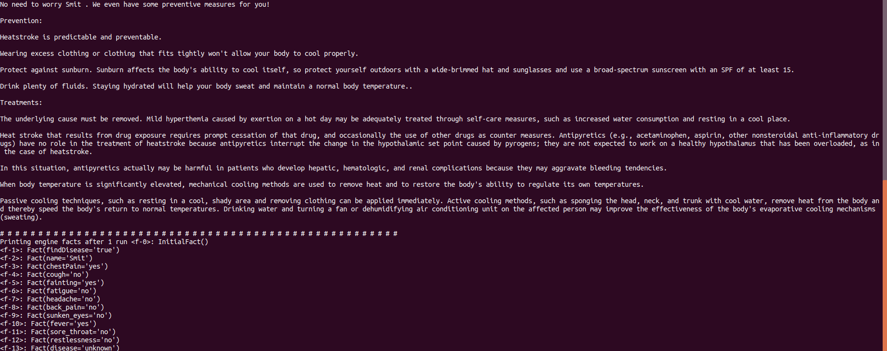

[](https://sonarcloud.io/dashboard?id=smit-1999_Medical-Expert-System)

[](https://sonarcloud.io/dashboard?id=smit-1999_Medical-Expert-System)

[](https://sonarcloud.io/dashboard?id=smit-1999_Medical-Expert-System)
# Table of Contents
  * [Demo](#demo)
  * [Summary](#summary)
  * [Installation](#installation)
  * [Authors](#authors)
  * [Contribution](#contribution)
  * [References](#references)

## Demo

*Questions asked to the bot*


*Information of the disease provided*


*Preventive Measures suggested by the bot*


## Summary

Typical expert systems use knowledge to reason about input data and produce meaningful results. This knowledge mostly consisted of simple if-then rules, like if temperature sensor values are > 100C then turn off the electric kettle. 

Knowledge bases and graphs are still playing a huge role in many intelligent systems.Many rural areas in India have extremely limited access to medical advice. People travel long distances to clinics, or medical facilities and there is a shortage of medical experts in most of these facilities. This results in slow service, and patients end up waiting long hours without receiving any attention. Hence, medical expert systems can play a significant role in such cases where medical experts are not readily available. A Diagnosis Expert System can help a great deal in identifying those diseases and describing methods of treatment to be carried out.

#### Features:
- Experta (*pyknow earlier*),a Python library is used as the core.
- The engine asks the user for 10 different symptoms.
- The user types *yes* or *no* to each symptom.
- The engine tries to determine the disease based on the user's responses and predefined rules.
- Once the disease is found, a detailed explanation regarding the disease and treatments are shown to the user.
- If the symptom does not match to a particular disease, the disease matching the highest number of symptoms is displayed to the user.
- The knowledge base for diseases can be shown to be a bipartite graph, with diseases on one side and symptoms on the other.This graph can be visualized by running the *knowledge_graph.py* file.


**Note: This project is just for demonstration purposes. The symptoms and diseases are likely to not match. It is an attempt to showcase how powerful these basic systems can get. Please do not use for any medical advice.**

## Installation

Python3 needs to be installed in your system.

**For installing _experta_:**
```bash
$ sudo pip3 install experta
```


**For running the main file use:**

```bash
$ python3 main.py
```


**To build a knowledge graph:**

```
$ python3 knowledge_graph.py
```

## Authors

**[Smit Shah](https://github.com/smit-1999)**


## Contribution
[Contribution guidelines for this project](docs/CONTRIBUTING.md)

## References
- [Experta](https://pypi.org/project/experta/)

